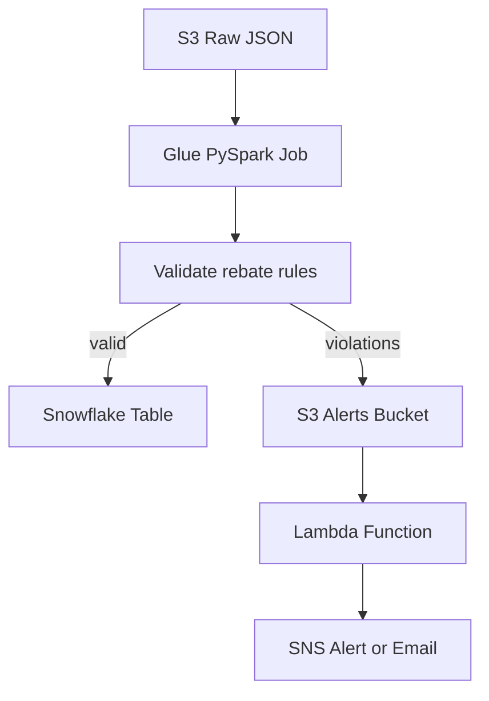

```markdown
# 🧬 PharmaRevenueX – ModelN-Inspired Cloud ETL Pipeline

A deployable, interview-ready **cloud data engineering project** simulating a pharmaceutical rebate workflow — inspired by Bayer’s use of Model N, **Snowflake**, and **AWS Glue**.

> 🔧 Built to demonstrate core skills in **ETL, orchestration, CI/CD, and IaC**, aligned with the Bayer Cloud Engineer role.

---

## 🎯 Purpose

Simulates a real-world ETL pipeline for **pharmaceutical rebate compliance** using:

- 🧪 **AWS Glue** (PySpark) – Rebate validation and transformation  
- 🏢 **Snowflake** – Warehousing of valid transactions  
- 🪝 **Lambda** – Alert triggers on rebate violations  
- 🔁 **Step Functions** – Orchestrating Glue and Lambda  
- ⚙️ **Terraform** – Infrastructure as Code  
- 🚀 **GitHub Actions** – CI/CD automation  

---

## 🗂 Project Structure

<pre lang="markdown"><code>
```text
pharma-revenue-x/
├── glue/
│   └── modeln_etl_job.py          # PySpark ETL validation logic
├── lambda/
│   └── alert_lambda.py            # Sends alerts if rebate violations detected
├── data/
│   └── modeln_sample.json         # Simulated Model N input
├── terraform/
│   ├── main.tf
│   ├── glue.tf
│   ├── lambda.tf
│   ├── snowflake.tf
│   └── iam.tf
├── .github/
│   └── workflows/
│       └── deploy.yml             # GitHub Actions CI/CD
├── architecture.drawio            # Architecture Diagram
└── README.md
```
</code></pre>


---

## ⚙️ Flow Overview



---

## 📥 Sample Input: `modeln_sample.json`

```json
[
  {
    "transaction_id": "T123",
    "customer_id": "C001",
    "sku": "SKU001",
    "unit_price": 100.00,
    "rebate_amount": 20.00,
    "transaction_date": "2025-07-20"
  }
]
```

---

## 🔧 Tech Stack

| Category         | Tool/Service               |
|------------------|----------------------------|
| ETL Engine       | AWS Glue (PySpark)         |
| Data Warehouse   | Snowflake                  |
| Alerts           | AWS Lambda + SNS           |
| Orchestration    | AWS Step Functions         |
| IaC              | Terraform                  |
| CI/CD            | GitHub Actions             |
| Security         | IAM, S3, KMS (optional)    |

---

## ✅ What It Demonstrates

| Capability              | Demo Element                      |
|-------------------------|-----------------------------------|
| Serverless ETL          | Glue Job with PySpark             |
| Data Quality Enforcement| Rebate rule validation            |
| Lakehouse Pipeline      | S3 → Snowflake via Glue           |
| Event-driven Design     | Lambda triggers on violations     |
| Workflow Orchestration  | Step Functions                    |
| CI/CD Automation        | GitHub Actions + Terraform        |
| Security Best Practices | IAM roles + KMS (optional)        |

---

## 📈 Use Cases

- ✅ Interview demo for Cloud/Data Engineer roles  
- 🧪 PoC for pharma rebate workflows  
- 🌩️ Extendable architecture for **AuroGenix cloud agents**

---

## 📌 Next Steps

- [ ] Deploy Terraform infra to AWS  
- [ ] Run ETL job via Step Function  
- [ ] Visualize Snowflake output (Power BI, Tableau, or Flask UI)  
- [ ] Extend: add Snowflake alerts or stored procedures  

---

## 🧠 Author

**Salman Shaik**  
Built for **Bayer Cloud Engineer interview** and to serve as a launchpad for future **AuroGenix infrastructure**.

---

## 🛡️ Disclaimer

This is a simulated project for educational and demonstration purposes only.  
No proprietary data, models, or business logic from Bayer or Model N is used.
```